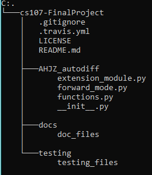

# Introduction

_Describe the problem the software solves and why it's important to solve that problem._

* Our software package, _ad-AHJZ_, computes gradients by leveraging the technique of automatic differentiation. Before we can understand automatic differentiation, we must first describe and motivate the importance of differentiation itself. Derivatives are vital to quantifying the change that’s occurring over a relationship between multiple factors. Finding the derivative of a function measures the sensitivity to change of a function value with respect to a change in its input argument. Derivatives generalize across multiple scenarios and are well defined for both scalar inputs and outputs, as well as vector inputs and outputs. Derivatives are not only essential in calculus applications like numerically solving differential equations and optimizing and solving linear systems, but are useful in many real world, scientific settings. For example, in finance they help analyze the change regarding the profit/loss for a business or finding the minimum amount of material to construct a building. In physics, they help calculate the speed and distance of a moving object. Derivatives are crucial to understanding how such relationships move and change.


* To perform differentiation, two different approaches are solving the task symbolically or numerically computing the derivatives. Symbolic differentation yields accurate answers, however depending on the complexity of the function, it could be expensive to evaluate and result in inefficient code. On the other hand, numerically computing derivatives is less expensive, however it suffers from potential issues with numerical stability and a loss of accuracy.   


* Our software package, _ad-AHJZ_, overcomes the shortcomings of both the symbolic and numerical approach. Our package uses automatic differentiation which is less costly than symbolic differentiation, but evaluates derivatives at machine precision. The technique leverages both forward mode and backward mode and evaluates each step with the results of previous computations or values. As a result of this, automatic differentiation avoids finding the entire analytical expresssion to compute the derivative and is hence iteratively evaluating a gradient based on input values. Thus, based on these key advantages, our library implements and performs forward mode automatic differentiation to efficiently and accurately compute derivatives.

  # Background

  _Describe (briefly) the mathematical background and concepts as you see fit._


  #### Part 1: Chain Rule

  The underlying motivation of automatic differentiation is the Chain Rule that enables us to decompose a complex derivative into a set of derivatives involving elementary functions of which we know explicit forms. 

  We will first introduce the case of 1-D input and generalize it to multidimensional inputs.

  _One-dimensional (scalar) Input_: Suppose we have a function *f*(*y*(*t*)) and we want to compute the derivative of *f* with respect to *t*. This derivative is given by:

  $$
  \begin{align}
  \frac{\partial f}{\partial t} = \frac{\partial f}{\partial y} \frac{\partial y}{\partial t}\\
  \end{align}
  $$

  Before introducing vector inputs, let's first take a look at the gradient operator ∇

  That is, for *y*: ℝ<sup>*n*</sup> → ℝ, its gradient ∇*y*: ℝ<sup>*n*</sup> → ℝ<sup>*n*</sup> is defined at the point *x* = (*x*<sub>1</sub>,...,*x*<sub>*n*</sub>) in n-dimensional space as the vector:

  $$
  \begin{align}
  \nabla y(x) =
  \begin{bmatrix}
  {\frac {\partial y}{\partial x_{1}}}(x)
  \\
  \vdots 
  \\
  {\frac {\partial y}{\partial x_{n}}}(x)
  \end{bmatrix}
  \end{align}
  $$

  _Multi-dimensional (vector) Inputs_: Suppose we have a function *f*(*y*<sub>1</sub>(*x*),...,*y*<sub>*n*</sub>(*x*)) and we want to compute the derivative of *f*  with respect to *x*. This derivative is given by:

  $$
  \begin{align} 
  \nabla f_x = \sum_{i=1}^n \frac{\partial f}{\partial y_i} \nabla y_i(x)\\
  \end{align}
  $$

  We will introduce direction vector *p* later to retrieve the derivative with respect to each *y*<sub>*i*</sub>. 

  #### Part 2: Jacobian-vector Product

  The Jacobian-vector product is equivalent to the tangent trace in direction *p* if we input the same direction vector *p*:

  *D*<sub>*p*</sub>*v* = *Jp*

  #### Part 3: Seed Vector

  Seed vectors provide an efficient way to retrieve every element in a Jacobian matrix and also recover the full Jacobian in high dimensions.

  _Scenario:_ Seed vectors often come into play when we want to find $\\frac {\\partial f_i} {\\partial x_j}$, which corresponds to the *i*, *j* element of the Jacobian matrix.

  _Procedure:_ In high dimension automatic differentiation, we will apply seed vectors at the end of the evaluation trace where we have recursively calculated the explicit forms of tangent trace of *f*<sub>*i*</sub> s and then multiply each of them by the indicator vector *p*<sub>*j*</sub> where the *j*-th element of the *p* vector is 1.

  ```
  
  
  ```

  ```
  
  
  \_Procedure:\_ In high dimension automatic differentiation, we will
  apply seed vectors at the end of the evaluation trace where we have
  recursively calculated the explicit forms of tangent trace of
  *f*<sub>*i*</sub>
  s and then multiply each of them by the indicator vector
  *p*<sub>*j*</sub>
  where the
  *j*
  -th element of the
  *p*
  vector is 1.
  ```


  #### Part 4: Evaluation (Forward) Trace

  _Definition_: Suppose x = $$ \begin{bmatrix} {x_1} \\ \vdots \\ {x_m} \end{bmatrix} $$, we defined $$ v_{k - m} = x_k $$ for $$ k = 1, 2, ..., m $$ in the evaluation trace.

  _Motivation_: The evaluation trace introduces intermediate results $$ v_{k-m} $$ of elementary operations to track the differentiation.

  Consider the function $ f(x):\mathbb{R}^2 \to \mathbb{R} $:

  $$f(x) = log(x_1) + sin(x_1 + x_2) $$

  We want to evaluate the gradient $ \nabla f $ at the point $ x = \begin{bmatrix} 7 \\ 4 \end{bmatrix} $. Computing the gradient manually: 

  $ \nabla f = \begin{bmatrix} \frac {\partial f} {\partial x_1} \\ \frac {\partial f} {\partial x_2} \end{bmatrix}  = \begin{bmatrix} \frac {1} {x_1} + \cos(x_1 + x_2) \\ \cos(x_1 + x_2) \end{bmatrix} = \begin{bmatrix} \frac {1} {7} + \cos(11) \\  \cos(11) \end{bmatrix}$

  | Forward primal trace   | Forward tangent trace             | Pass with p = $[0, 1]^T$     | Pass with p = $[1, 0]^T$ |
  | ---------------------- | --------------------------------- | ---------------------------- | ------------------------ |
  | $v_{-1} = x_1$         | $ p_1 $                           | 1                            | 0                        |
  | $v_{0} = x_2$          | $ p_2 $                           | 0                            | 1                        |
  | $v_{1} = v_{-1} + v_0$ | $ D_p v_{-1} + D_p v_0 $          | 1                            | 1                        |
  | $v_{2} = sin(v_1)$     | $ \cos(v_1) D_p v_1 $             | $ \cos(11) $                 | $ \cos(11) $             |
  | $v_{3} = log(v_{-1})$  | $ \frac {1} {v_{-1}} D_p v_{-1} $ | $ \frac {1} {7} $            | 0                        |
  | $v_{4} = v_3 + v_2 $   | $ D_p v_{3} + D_p v_2 $           | $ \frac {1} {7} + \cos(11) $ | $ \cos(11) $             |

  $D_p v_{-1} = \nabla v_{-1}^T p = (\frac {\partial v_{-1}} {\partial x_1} \nabla x_{1})^T p = (\nabla x_{1})^T p = p_1$

  $D_p v_{0} = \nabla v_{0}^T p = (\frac {\partial v_{0}} {\partial x_2} \nabla x_{2})^T p = (\nabla x_{2})^T p = p_2$

  $D_p v_{1} = \nabla v_{1}^T p = (\frac {\partial v_{1}} {\partial v_{-1}} \nabla v_{-1} + \frac {\partial v_{1}}{\partial v_{0}} \nabla v_{0})^T p = (\nabla v_{-1} + \nabla v_0)^T p = D_p v_{-1} + D_p v_0$

  $D_p v_{2} = \nabla v_{2}^T p = (\frac {\partial v_{2}} {\partial v_{1}} \nabla v_1)^T p = \cos(v_1) (\nabla v_1)^T p = \cos(v_1) D_p v_1$

  $D_p v_{3} = \nabla v_{3}^T p = (\frac {\partial v_{3}} {\partial v_{-1}} \nabla v_{-1})^T p = \frac {1} {v_{-1}} (\nabla v_{-1})^T p = \frac {1} {v_{-1}} D_p v_{-1}$

  $D_p v_{4} = \nabla v_{4}^T p = (\frac {\partial v_{4}} {\partial v_3} \nabla v_{3} + \frac {\partial v_{4}}{\partial v_{2}} \nabla v_{2})^T p = (\nabla v_{3} + \nabla v_2)^T p = D_p v_{3} + D_p v_2$

  #### Part 5: Computation (Forward) Graph

  We have connected each $ v_{k-m} $ to a node in a graph for a visualization of the ordering of operations.

  From the above example, its computational graph is given by: 

  

  #### Part 6: Computing the Derivative 

  Let's generalize our findings:

  From the table, we retrieved a pattern as below:

  $$ D_p v_j = (\nabla v_j)^T p = (\sum_{i < j} \frac{\partial{v_j}} {\partial{v_i}} \nabla v_i)^T p = \sum_{i < j} \frac{\partial{v_j}} {\partial{v_i}} (\nabla v_i)^T p = \sum_{i < j} \frac{\partial{v_j}} {\partial{v_i}} D_p v_i$$ 

  _Higher dimension_: We recursively apply the same technique introduced above to each entry of the vector valued function _f_.


  #### Part 7: Efficiency of Forward Mode 

  Forward mode is efficient in the sense that it does not need to store the parent node, which is different from reverse mode (see below) where the whole computational graph must be stored.

  #### Part 8: Reverse Mode
  The mechanism of reverse mode is defined as the following:

  _Step 1:_ Calculate $ \frac {\partial f} {\partial v_j} $

  _Step 2:_ Calculate $ \frac {\partial v_{j}} {\partial v_i} $ where $ v_i $ is the immediate predecessor of $ v_j $

  _Step 3:_ Multiply the result obtained in step 1 and step 2, which results in the following:
  $ \frac {\partial f} {\partial v_j} \frac {\partial v_{j}} {\partial v_i} $

  #### Part 9: Dual Number 

  _Naively_: We define a dual number $ d_i = v_i + \delta_i $ where $ \delta_i = D_p v_i \epsilon $ that satisfies $ \epsilon^2 = 0 $ 

  A $ k $-th differentiable function $ f $ can be written as:

  $ f(d_i) = f(v_i + \delta_i) = f(v_i) + f'(v_i) \delta_i + \frac {f''(v_i)} {2!} \delta_i^2 + ... + \frac {{{f}^k}(v_i)} {k!} (\zeta - v_i)^k $ for some $ \zeta \in (v_i, v_i + \delta_i) $ by Taylor expansion. 

  Now we substitute the definition of $ \delta_i $ back into the above expansion and use the fact that all higher terms go to 0 assuming $ \epsilon^2 = 0 $. We will have the following:

  $ f(d_i) = f(v_i) + f'(v_i) D_p v_i \epsilon $

  _Advantage_: Operations on Dual Number pertain to the form of Taylor expansion, which makes the implementation easier to retrive the value and derivative.

  Consider the following example:
  $$
  \begin{align}
  d_i &= v_i + D_p v_i \epsilon \\ 
  f(d_i) &= d_i^2 = v_i^2 + 2 v_i D_p v_i \epsilon + D_p v_i^2 \epsilon^2 = v_i^2 + 2 v_i D_p v_i \epsilon \\
  \end{align}
  $$

  where $ v_i^2 $ refers to the value and $ 2 v_i D_p v_i $ refers to the derivative.

  More specifically, $ v_i^2 $ corresponds to $ f(v_i) $, $ 2 v_i $ corresponds to $ f'(v_i) $, and $ D_p v_i $ is just $ D_p v_i $.

  # How to Use ad-AHJZ

  _How do you envision that a user will interact with your package? What should they import? How can they instantiate AD objects?_

  #### 1. __Installing the package:__

  * 1a. User can install the package and its dependencies using the virtual environment venv:

  ```bash
  # Create a directory to store your virtual environment(s)
  mkdir ~/.virtualenvs
  python3 -m venv ~/.virtualenvs/env_name
  # Activate your env_name virtual environment
  source ~/.virtualenvs/env_name/bin/activate
  # Install the package
  python3 -m pip install ad-AHJZ
  python3 -m pip install -r requirements.txt
  # Create a Python file to use the package in
  echo >'file_name'.py
  ```

  * 1b. User can install the package and its dependencies using the virtual environment conda:

  ```bash
  # Create a directory to store your virtual environment(s)
  mkdir 'directory_name_for_virtual_environment'
  cd 'directory_name_for_virtual_environment'
  conda create -n 'env_name' python=3.7 anaconda
  # Activate your env_name virtual environment
  source activate env_name
  # Install the package
  python3 -m pip install ad-AHJZ
  python3 -m pip install -r requirements.txt
  # Create a Python file to use the package in
  echo >'file_name'.py
  ```

  #### 2. __Importing the package:__

     * 2a. User imports package into the desired python file with the following line:

  ```python
  from ad_AHJZ import foward_mode, # reverse_mode (once implemented)
  ```

     * 2b. User imports numpy into the desired python file with the following line:

  ```python
  import numpy as np
  ```


  ​    
  #### 3. __Calling/Using package modules:__
     * 3a. Using the class forward_mode() create an automatic differentiation object that can use either a scalar or vector input to obtain both the function value and derivative. Below are examples using a scalar input and a vector input:  


     * 3b. Example of foward_mode() using a scalar input:

  ```python
  # define desired evaluation value (scalar)
  x = 0.5
  # define a simple function:
  f_x = lambda x: np.sin(x) + 2 * x
  # create a foward_mode() object using the defined values x, f_x from above
  fm = forward_mode(x, f_x)
  # option 1: retrieve both the function value and the derivative using get_function_value_and_jacobian()
  x, x_der = fm.get_function_value_and_jacobian()
  print(x, x_der)
  >>> 1.479425538604203
      [2.87758256]
  # option 2: retrieve only the function value using get_function_value()
  x_value = fm.get_function_value()
  print(x_value)
  >>> 1.479425538604203
  # option 3: retrieve only the function derivative using get_jacobian()
  x_derivative = fm.get_jacobian()
  print(x_derivative)
  >>> [2.87758256]
  ```
     * 3c. Example of foward_mode() using a vector input:

  ```python
  # define desired evaluation value (scalar)
  multi_input = [0.5, 1]
  # define a simple function:
  f_xy = lambda x, y: np.sin(x) + 2 * y
  # create a foward_mode() object using the defined values x, f_x from above
  fm = forward_mode(multi_input, f_xy)
  # option 1: retrieve both the function value and the jacobian using get_function_value_and_jacobian()
  multi_xy, multi_xy_der = fm.get_function_value_and_jacobian()
  print(multi_xy, multi_xy_der)
  >>> 2.479425538604203
      [0.87758256 2.        ]
  # option 2: retrieve only the function value using get_function_value()
  multi_xy_value = fm.get_function_value()
  print(multi_xy_value)
  >>> 2.479425538604203
  # option 3: retrieve only the function jacobian using get_jacobian()
  multi_xy_derivative = fm.get_jacobian()
  print(multi_xy_derivative)
  >>> [0.87758256 2.        ]
  ```

_Discuss how you plan on organizing your software package._


#### 1. __Directory Structure:__
   * 1a. We include our project directory structure in the image below. Our package is called _ad-AHJZ_, where our code for automatic differentiation lies within "ad_AHJZ", our milestone documentation lies within "docs", all unit testing files are located in "testing", and the root of the directory holds our readme.md, license, .gitignore, .coveragerc, codecov.yml, setup.cfg, setup.py, and requirements.txt file.


   * 1b. Directory structure layout:

  


#### 2. __Modules:__

   * 2a. _val_derv.py_: This file contains the class definition of a value/derivative object. It contains methods to initialize the object, set and get the function and derivative value of the object, and overload elementary operations. Specifically, we overload addition, multiplication, division, negation, power, reverse addition, reverse subtraction, reverse multiplication, and reverse division. Finally, we include elementary functions on these objects including 'sqrt', 'log', 'exp', 'sin', 'cos', 'tan', 'sinh', 'cosh', 'tanh', 'arcsin', 'arccos', and 'arctan'. This is not a file which the user will interact with.


   * 2b. _forward_mode.py_: This file contains the class definition to perform forward mode automatic differentiation. This is the module which the user will interact with to compute function values and derivatives using forward mode. Specifically, the user will create forward mode objects using the function they are interested in computing the derivative of and the point or vector at which to evaluate the function at. Next, after initialization, they can make use of get_function_value() to retrieve function values, get_jacobian to retrieve derivative values, and get_function_value_jacobian() to retrieve both the function and derivative values. 


   * 2c. \_\__init.py\_\__:  This file contains information relevant to how each of the modules associated with our package ad-AHJZ interact with one another. 


   * 2d . _reverse_mode.py_: This file (once implemented) will contain the class definition to perform reverse mode automatic differentiation. This is the module which the user will interact with to compute function values and derivatives using reverse mode. Specifically, the user will create forward mode objects using the function they are interested in computing the derivative of and the point or vector at which to evaluate the function at. Next, after initialization, the user will call the methods on this objects to retrieve function and derivative values.  


#### 3. __Test Suite Location:__
   * 3a. The test suite live in the "testing" directory which is a subdirectory found off the root directory (see 1. Directory Structure). The "testing" directory contains all unit tests and integration tests.


   * 3b. Our testing suite is built using Python's unittest framework. We have two files for testing, which are test_val_derv.py and test_forward_mode.py. The first file tests scalar inputs for val_derv.py to ensure all overloaded operations and elementary functions are implemented correctly and the second file tests forward_mode.py to ensure the automatic differentiation is performed correctly in terms of computing function values and derivatives. We run our tests by running "coverage run  -m unittest discover -s tests/" in the root directory. 


   * 3c. To ensure our testing procedure has complete code coverage, we leverage CodeCov. CodeCov enables us to quickly understand which lines are being executed in our test cases. We directly upload our coverage reports to CodeCov through the use of a bash script and the .coveragerc, coverage, and codecov.yml files.

#### 4. __Package Distribution and Installation:__
   * 4a. Our package is distributed via PyPI. We have uploaded the package to PyPI using the setup.py and setup.cfg files which contain relevant information about our package as well as the version number, associated dependencices, and the license.  


   * 4b. A user can install our package by creating a virtual environment as shown in _Installing the package_ under the " How to Use ad-AHJZ" heading earlier. Once a virtual environment has been created, the user can install our package by running the following lines: 

``` bash
python3 -m pip install ad-AHJZ
python3 -m pip install -r requirements.txt
```
* 4c: After installing our package, a user can import it into their desired python file and use it by including the following two lines at the top of their file: 
```python
from ad_AHJZ import foward_mode, # reverse_mode (once implemented)
import numpy as np
```

#### 5. __Package Dependencies__
   * 5a. The only library dependency our package relies on is numpy. We designed our software in this manner to ensure that we are not creating multiple external dependencies and thereby increase our software's reliability.

# Implementation

_Discuss how you plan on implementing the forward mode of automatic differentiation._

#### 1.  __Core Data Structure:__
  * 1a. Our primary core data structure is a numpy array where we convert both the variables and the function list into two separate arrays which are then used to compute the derivative and function value for either a scalar or vector input. Our secondary core data structure is a tuple that holds output of our forward mode which is the function value and derivative.      
    
      
#### 2.  __Classes:__

* 2a. _Val Derv:_ The class that creates our val_derv object. This object has two attributes: the value and the derivative seed, which can be defined at instantiation. This object will be used with the elementary function methods to calculate the value, and the dual number at a particular state of the primal or tangent trace. 

* 2b. _Forward Mode:_ The class that creates a forward_mode object. This object has two attributes: the variable list and the function list, which can be defined at instantiation. Both attributes can be in either the scalar or vector form, and will be used to find either the function value, the jacobian, or both.     

* 2c. _Reverse Mode_ (extension module): The class that creates a reverse_mode object. This object has two attributes: the variable list and the function list, which can be defined at instantiation. Both attributes can be in either the scalar or vector form, and will be used to find either the function value, the jacobian, or both. 


​    
​    
#### 3.  __Method and Name Attributes:__
* 3a. _Val Derv_
    * __init__: Constructor for the val_derv class.

    * __repr__: Operator overloading for val_derv object string representations

    * @property
      val :   Gets the val attribute of val_derv object

    * @property
      derv :  Gets the derv attribute of val_derv object

    * @val.setter
      val : Sets the val attribute of val_derv object

    * @derv.setter
      derv : Sets the derv attribute of val_derv object

    * __add__: Compute the value and derivative of the addition operation

    * __mul__: Compute the value and derivative of the multiplication operation

    * __truediv__: Compute the value and derivative of the division operation

    * __neg__: Compute the value and derivative of the negation operation

    * __pow__:  Compute the value and derivative of the power operation

    * __radd__: Compute the value and derivative of the addition operation

    * __rsub__: Compute the value and derivative of the subtraction operation

    * __rmul__: Compute the value and derivative of the multiplication operation

    * __rtruediv__: Compute the value and derivative of the division operation

    * __rpow__: Compute the value and derivative of the power operation

    * sqrt: Compute the value and derivative of the square root function

    * log: Compute the value and derivative of logarithmic function (Default logarithmic base is None)

    * exp: Compute the value and derivative of exponential function

    * sin: Compute the value and derivative of the sine function

    * cos: Compute the value and derivative of the cosine function

    * tan: Compute the value and derivative of the tangent function

    * sinh: Compute the value and derivative of the hyperbolic sine function

    * cosh: Compute the value and derivative of the hyperbolic cosine function

    * tanh: Compute the value and derivative of the hyperbolic tangent function

    * arcsin: Compute the value and derivative of the inverse sine function

    * arccos: Compute the value and derivative of the inverse cosine function

    * arctan: Compute the value and derivative of the inverse tangent function

* 3b. _Forward Mode_ 
    * __init__: Constructor for the forward_mode class.

    * get_function_value: Extracts the function value from the function 'get_function_value_and_jacobian'

    * get_jacobian: Extracts the jacobian matrix from the function 'get_function_value_and_jacobian'

    * get_function_value_and_jacobian: Calculates the function value and jacobian of a user input function 

* 3c. _Reverse Mode (Potential Methods)_
    * __init__: Constructor for the forward_mode class.

    * get_function_value: Extracts the function value from the function 'get_function_value_and_jacobian'

    * get_jacobian: Extracts the jacobian matrix from the function 'get_function_value_and_jacobian'

    * get_function_value_and_jacobian: Calculates the function value and jacobian of a user input function

    

#### 4. __External Dependencies:__
* 4a. To be viewed as a near stand alone software package, to improve adoption, and increase efficiency of our package we chose to only employ a single external library numpy. We’ve used the numpy library to create our data structure for the computational graph and perform computations outside of those we created in our val_derv class. This will enable us to be viewed as a near stand alone software package.  
  
    
#### 5.  __Dealing With Elementary Functions__
* 5a. As listed above, within the val_derv class we’ve overloaded the simple arithmetic functions (addition, subtraction, multiplication, and power) to calculate both the value and the dual number we’ve also defined our own elementary functions, such as sin(x) and sqrt(x) to also compute the value and the dual number. This module will generalize each of the functions in order to handle both scalar and vector input. Each method will also indicate errors specific to the type of invalid input. The output will be a tuple of both the function value and the derivative, which will be used in both the foward_mode and the reverse_mode.    
* 5b. For example, we would use the below functions to implement _sin_ and _sqrt_, both of which work with scalar or vector input _x_ values: 

```python  
# sqrt of variable with scalar derivative
x = val_derv(1, 1)
print(x.sqrt())
>>>Values:1.0, Derivatives:0.5
```
```python 
# sqrt of variable with vector derivative
x = val_derv(1, np.array([1, 0]))
print(x.sqrt())
>>>Values:1.0, Derivatives:[0.5 0. ]
```
```python 
# sin of variable with scalar derivative
x = val_derv(0, 1)
print(x.sin())
>>>Values:0.0, Derivatives:1.0

```
```python
# sin of variable with vector derivative
x = val_derv(0, np.array([1, 0]))
print(x.sin())
>>> Values:0.0, Derivatives:[1. 0.]
```

#### 6.  __Next Steps__
* 6a. As mentioned before our next steps will be to implement reverse_mode, similar to our forward mode. This class will employ a dictionary data structure to store the computational graph and will depend on our val_derv class to compute the value and dual numbers for the elementary functions. We will also expand the number of elementary functions our package will be able to calculate the value and derivative for,  by adding methods such as less than and greater than. After we will then look towards implementing an optimized version of our forward class to improve efficiency, while using complex inputs. 